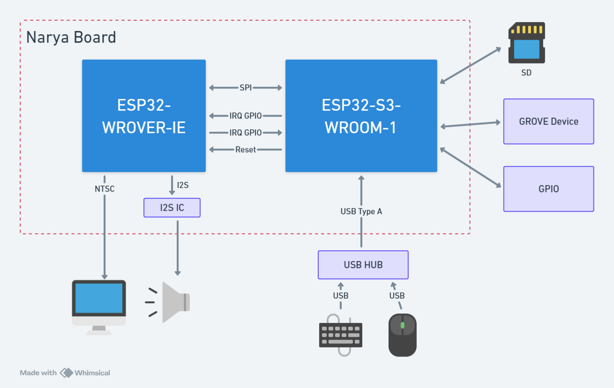
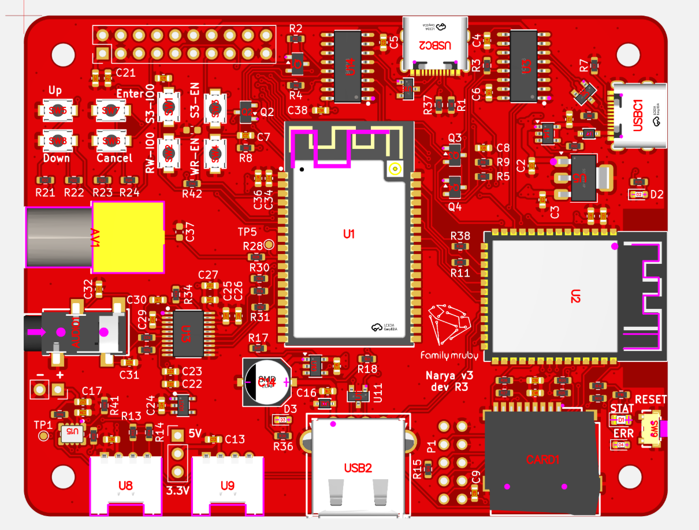

# Narya Board

A dual ESP32 development board featuring both ESP32-WROVER-IE and ESP32-S3-WROOM-1 modules on a single PCB.

## Overview

Narya Board is a versatile hardware platform that integrates two popular ESP32 variants, providing developers with flexibility for WiFi/Bluetooth applications, IoT prototyping, and embedded systems development.

## Features

- **Dual ESP32 Modules:**
  - ESP32-WROVER-IE (16MB Flash) - ESP32 classic with PSRAM
  - ESP32-S3-WROOM-1 (N16R8) - Latest ESP32-S3 with 16MB Flash and 8MB PSRAM
- **Video Output:** NTSC composite video output for retro gaming and multimedia applications
- **Audio Output:** Integrated audio output for sound and music playback
- **USB Host:** USB host interface for connecting peripherals
- **SD Card:** MicroSD card slot for external storage and data logging
- **GROVE Connector:** Standard GROVE connector for easy sensor and module integration
- **KiCad 9.0:** Designed with the latest KiCad EDA suite

## Hardware Specifications

## Block Diagram



### ESP32-WROVER-IE Module
- MCU: ESP32 Dual-core Xtensa LX6
- Flash: 16MB
- PSRAM: 8MB

### ESP32-S3-WROOM-1 Module
- MCU: ESP32-S3 Dual-core Xtensa LX7
- Flash: 16MB (N16)
- PSRAM: 8MB (R8)

## Project Structure

```
narya-board/
├── dev/
│   └── dev-board/              # Main KiCad project
│       ├── dev-board.kicad_pcb # PCB layout
│       ├── dev-board.kicad_sch # Main schematic
│       ├── dev-board.kicad_pro # KiCad project file
│       ├── S3_peripheral.kicad_sch        # ESP32-S3 peripheral circuits
│       ├── wrover_peripheral.kicad_sch   # WROVER peripheral circuits
│       ├── kicad/              # Custom libraries and footprints
│       └── production/         # Manufacturing files
│           ├── dev-board.zip   # Gerber files for fabrication
│           └── netlist.ipc     # IPC netlist
├── LICENSE
└── README.md
```

## History

### v3.0 dev R1



## License

This project is licensed under the CERN-OHL-S - see the [LICENSE](LICENSE) file for details.

---

**Note:** This is a hardware development project. Ensure you have appropriate knowledge of electronics and safety precautions when working with these modules.